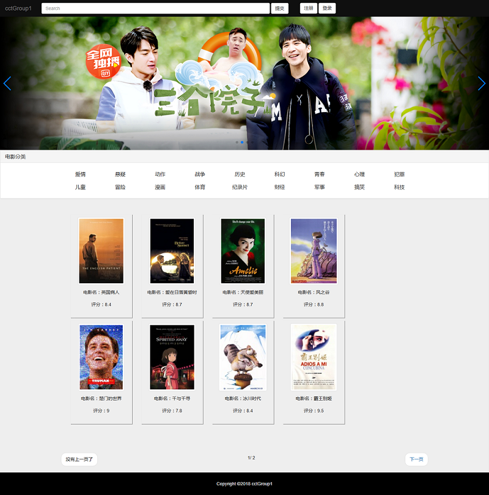
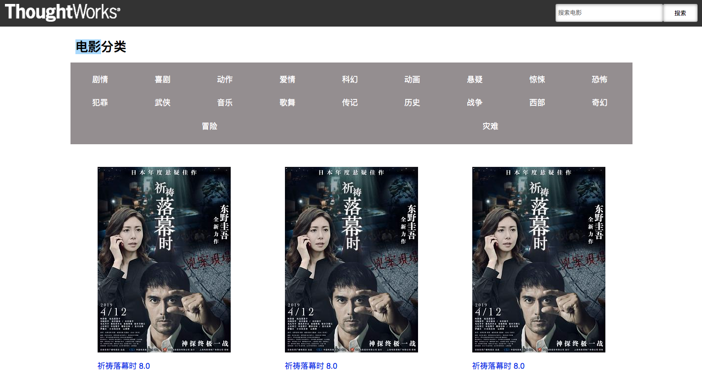
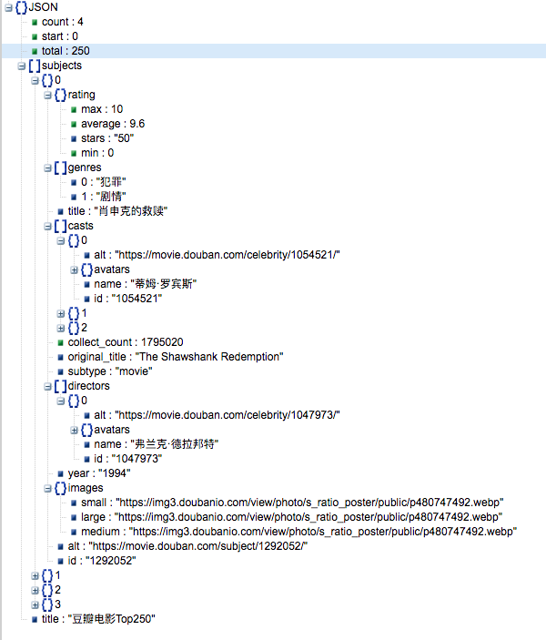
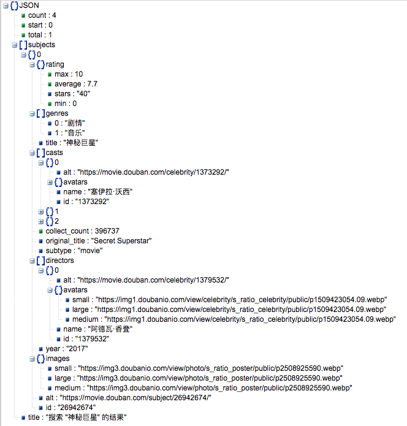
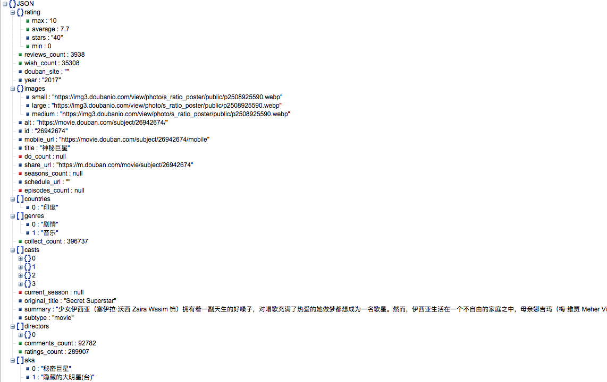
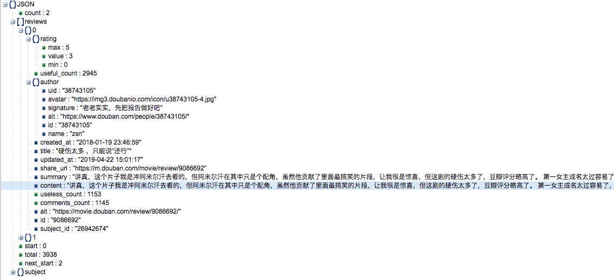

# 基于界面的任务分析

## 一、界面图

### 1. 参考页面



### 2. 实际效果




## 二、界面业务分析

### 1. 界面触发操作
**界面一包含的触发操作**
1. 搜索按钮
2. 类型组建
3. 电影封面
4. 电影标题

**界面二包含的触发操作**
1. 搜索按钮
2. 电影封面
3. 电影标题

> 从上述分析可知，界面一和界面二存在共同的触发操作和业务逻辑，同时电影封面和电影标题的触发操作应该是相同的，即跳转到电影详情页面。总的所来一共只有三种业务逻辑。

### 2. 业务逻辑流程：
**1. 页面加载：**
> 当我们初次打开网页时，网页主页面应该家在当前TOP250的8部电影
> API举例如下：<br>
```
https://api.douban.com/v2/movie/top250?start=0&count=8
```
> start:数据起点<br>
> count:单页显示条数<br>
> 为了更少的参数改变，设定为只改变关键字，只检索top250的前8部电影<br>
> 返回json对象如下
<table>
    <tbody>
        <tr>
            <td>key</td>
            <td>类型</td>
            <td>描述</td>
        </tr>
        <tr>
            <td>count</td>
            <td>int</td>
            <td>单页条数</td>
        </tr>
        <tr>
            <td>start</td>
            <td>int</td>
            <td>数据的开始项</td>
        </tr>
        <tr>
            <td>total</td>
            <td>int</td>
            <td>数据总条数</td>
        </tr>
        <tr>
            <td>subjects</td>
            <td>json数组</td>
            <td>电影列表</td>
        </tr>
        <tr>
            <td>— id</td>
            <td>string</td>
            <td>电影id</td>
        </tr>
        <tr>
            <td>— title</td>
            <td>string</td>
            <td>电影名中文名</td>
        </tr>
        <tr>
            <td>— images</td>
            <td>json对象</td>
            <td>存放各种大小的电影图</td>
        </tr>
        <tr>
            <td>—— small／large／medium</td>
            <td>string</td>
            <td>电影图url</td>
        </tr>
        <tr>
            <td>— genres</td>
            <td>json数组</td>
            <td>电影类型</td>
        </tr>
        <tr>
            <td>— rating</td>
            <td>json对象</td>
            <td>评分信息</td>
        </tr>
        <tr>
            <td>—— average</td>
            <td>float</td>
            <td>电影评分</td>
        </tr>
        <tr>
            <td>— directors</td>
            <td>json数组</td>
            <td>导演列表</td>
        </tr>
        <tr>
            <td>—— name</td>
            <td>string</td>
            <td>导演名</td>
        </tr>
        <tr>
            <td>— casts</td>
            <td>json数组</td>
            <td>主演列表</td>
        </tr>
        <tr>
            <td>—— name</td>
            <td>string</td>
            <td>主演名</td>
        </tr>
        <tr>
            <td>— year</td>
            <td>int</td>
            <td>年份</td>
        </tr>
    </tbody>
</table>



**2. 搜索按钮：**
> 目前设定只支持电影名搜索：<br>
> API举例如下：<br>
```
https://api.douban.com/v2/movie/search?q=神秘巨星&start=0&count=4
```
> q:搜索电影关键字<br>
> start:数据起点<br>
> count:单页显示条数<br>
> 为了更少的参数改变，设定为只改变关键字，只检索包含关键字的前四部电影<br>
> 返回json对象如下
<table>
    <tbody>
        <tr>
            <td>key</td>
            <td>类型</td>
            <td>描述</td>
        </tr>
        <tr>
            <td>count</td>
            <td>int</td>
            <td>单页条数</td>
        </tr>
        <tr>
            <td>start</td>
            <td>int</td>
            <td>数据的开始项</td>
        </tr>
        <tr>
            <td>total</td>
            <td>int</td>
            <td>数据总条数</td>
        </tr>
        <tr>
            <td>subjects</td>
            <td>json数组</td>
            <td>电影列表</td>
        </tr>
        <tr>
            <td>— id</td>
            <td>string</td>
            <td>电影id</td>
        </tr>
        <tr>
            <td>— title</td>
            <td>string</td>
            <td>电影名中文名</td>
        </tr>
        <tr>
            <td>— images</td>
            <td>json对象</td>
            <td>存放各种大小的电影图</td>
        </tr>
        <tr>
            <td>—— small／large／medium</td>
            <td>string</td>
            <td>电影图url</td>
        </tr>
        <tr>
            <td>— genres</td>
            <td>json数组</td>
            <td>电影类型</td>
        </tr>
        <tr>
            <td>— rating</td>
            <td>json对象</td>
            <td>评分信息</td>
        </tr>
        <tr>
            <td>—— average</td>
            <td>float</td>
            <td>电影评分</td>
        </tr>
        <tr>
            <td>— directors</td>
            <td>json数组</td>
            <td>导演列表</td>
        </tr>
        <tr>
            <td>—— name</td>
            <td>string</td>
            <td>导演名</td>
        </tr>
        <tr>
            <td>— casts</td>
            <td>json数组</td>
            <td>主演列表</td>
        </tr>
        <tr>
            <td>—— name</td>
            <td>string</td>
            <td>主演名</td>
        </tr>
        <tr>
            <td>— year</td>
            <td>int</td>
            <td>年份</td>
        </tr>
    </tbody>
</table>



**3. 分类组建：**
> 根据标签搜索：<br>
> API举例如下：<br>
```
https://api.douban.com/v2/movie/search?tag=喜剧&start=0&count=4
```
> tag:搜索电影关键字<br>
> start:数据起点<br>
> count:单页显示条数<br>
> 为了更少的参数改变，设定为只改变关键字，只检索包含关键字的前四部电影<br>
> 返回json对象如下
<table>
    <tbody>
        <tr>
            <td>key</td>
            <td>类型</td>
            <td>描述</td>
        </tr>
        <tr>
            <td>count</td>
            <td>int</td>
            <td>单页条数</td>
        </tr>
        <tr>
            <td>start</td>
            <td>int</td>
            <td>数据的开始项</td>
        </tr>
        <tr>
            <td>total</td>
            <td>int</td>
            <td>数据总条数</td>
        </tr>
        <tr>
            <td>subjects</td>
            <td>json数组</td>
            <td>电影列表</td>
        </tr>
        <tr>
            <td>— id</td>
            <td>string</td>
            <td>电影id</td>
        </tr>
        <tr>
            <td>— title</td>
            <td>string</td>
            <td>电影名中文名</td>
        </tr>
        <tr>
            <td>— images</td>
            <td>json对象</td>
            <td>存放各种大小的电影图</td>
        </tr>
        <tr>
            <td>—— small／large／medium</td>
            <td>string</td>
            <td>电影图url</td>
        </tr>
        <tr>
            <td>— genres</td>
            <td>json数组</td>
            <td>电影类型</td>
        </tr>
        <tr>
            <td>— rating</td>
            <td>json对象</td>
            <td>评分信息</td>
        </tr>
        <tr>
            <td>—— average</td>
            <td>float</td>
            <td>电影评分</td>
        </tr>
        <tr>
            <td>— directors</td>
            <td>json数组</td>
            <td>导演列表</td>
        </tr>
        <tr>
            <td>—— name</td>
            <td>string</td>
            <td>导演名</td>
        </tr>
        <tr>
            <td>— casts</td>
            <td>json数组</td>
            <td>主演列表</td>
        </tr>
        <tr>
            <td>—— name</td>
            <td>string</td>
            <td>主演名</td>
        </tr>
        <tr>
            <td>— year</td>
            <td>int</td>
            <td>年份</td>
        </tr>
    </tbody>
</table>


**4. 电影封面或者标题：**
> 根据电影的ID搜索：<br>
> API举例如下：<br>
```
https://api.douban.com/v2/movie/subject/26942674
```
> 末尾的数字为电影ID，ID是搜索时返回的数据<br>
> 为了更少的参数改变，设定为只改变关键字，只检索包含关键字的前四部电影<br>
> 返回json对象如下
<table>
    <tbody>
        <tr>
            <td>key</td>
            <td>类型</td>
            <td>描述</td>
        </tr>
        <tr>
            <td>id</td>
            <td>string</td>
            <td>电影id</td>
        </tr>
        <tr>
            <td>title</td>
            <td>string</td>
            <td>电影名中文名</td>
        </tr>
        <tr>
            <td>original_title</td>
            <td>string</td>
            <td>电影原名</td>
        </tr>
        <tr>
            <td>images</td>
            <td>json对象</td>
            <td>存放各种大小的电影图</td>
        </tr>
        <tr>
            <td>— small／large／medium</td>
            <td>string</td>
            <td>电影图url</td>
        </tr>
        <tr>
            <td>genres</td>
            <td>json数组</td>
            <td>电影类型</td>
        </tr>
        <tr>
            <td>rating</td>
            <td>json对象</td>
            <td>评分信息</td>
        </tr>
        <tr>
            <td>— average</td>
            <td>float</td>
            <td>电影评分</td>
        </tr>
        <tr>
            <td>ratings_count</td>
            <td>int</td>
            <td>评分人数</td>
        </tr>
        <tr>
            <td>directors</td>
            <td>json数组</td>
            <td>导演列表</td>
        </tr>
        <tr>
            <td>— name</td>
            <td>string</td>
            <td>导演名</td>
        </tr>
        <tr>
            <td>—avatars</td>
            <td>json对象</td>
            <td>各种大小的影人头像图</td>
        </tr>
        <tr>
            <td>— small／large／medium</td>
            <td>string</td>
            <td>头像图url</td>
        </tr>
        <tr>
            <td>casts</td>
            <td>json数组</td>
            <td>主演列表</td>
        </tr>
        <tr>
            <td>— name</td>
            <td>string</td>
            <td>主演名</td>
        </tr>
        <tr>
            <td>—avatars</td>
            <td>json对象</td>
            <td>各种大小的影人头像图</td>
        </tr>
        <tr>
            <td>— small／large／medium</td>
            <td>string</td>
            <td>头像图url</td>
        </tr>
        <tr>
            <td>year</td>
            <td>int</td>
            <td>年份</td>
        </tr>
        <tr>
            <td>countries</td>
            <td>json数组</td>
            <td>制片国家/地区</td>
        </tr>
        <tr>
            <td>summary</td>
            <td>string</td>
            <td>简介</td>
        </tr>
    </tbody>
</table>



**5. 电影长篇评论：**
> 根据电影的ID搜索：<br>
> API举例如下：<br>
```
https://api.douban.com/v2/movie/subject/26942674/reviews?start=0&count=2&apikey=0b2bdeda43b5688921839c8ecb20399b
```
> 末尾的数字为电影ID，ID是搜索时返回的数据<br>
> start:数据起点<br>
> count:单页显示条数<br>
> apikey:0b2bdeda43b5688921839c8ecb20399b，为固定值<br>
> 为了更少的参数改变，设定为只改变关键字，只检索包含关键字的前四部电影<br>
> 由于长篇评论太长了，返回数据的过程很慢，建议一次只显示一个长篇评论，除非用户点击加载更多评论按钮



**6. 电影推荐：**
> 关于电影推荐这一块，目前市场上常见的推荐算法有基于物品或者基于用户的协同推荐，但是都需要一个强大的数据库来支撑。<br>
> 解决方案一：所以对这一部分进行相关的简化，Top250中的随机四部电影。<br>
> API举例如下：<br>
```
https://api.douban.com/v2/movie/top250?start=0&count=4
```
> start:数据起点<br>
> count:单页显示条数<br>
> 为了体现推荐的个性化，可以使用对`start`和`count`进行随机赋值<br>
----------------
> 解决方案二：类型匹配，评分比较。以《神秘巨星》为例，其类型为剧情、音乐。通过豆瓣API获取类型为剧情和音乐各100条电影数据，取出两种类型电影数据的交集；在和《神秘巨星》的评分进行比较，低于该评分舍弃，在屏幕上显示其中的四部电影<br>
> API举例如下：<br>
```
https://api.douban.com/v2/movie/search?tag=喜剧&start=0&count=4
```
> tag:搜索电影关键字<br>
> start:数据起点<br>
> count:单页显示条数<br>
> 为了更少的参数改变，设定为只改变关键字，只检索包含关键字的前四部电影<br>
----------------
> 解决方案三：建立本地数据库，搭建推荐系统。难度系数较高如果以后涉及到系统完善或者对推荐系统感兴趣，可以重新来玩一玩，目前我已经储备好几个关于推荐系统构建的链接和论文<br>

为了尽快实现系统，使用方案1。完成上述的分析之后，数据就有着落了，接下来就是数据的交互和业务逻辑程序

## 三、Tasking图


## 三、Tasking Pileline
- [跨域API调用脚本](https://www.jianshu.com/p/1f32c9a96064)
```
var responseHandler; // 定义一个全局作用域的函数

function getJSONP(url, cb) {
  if (url.indexOf('?') === -1) {
    url += '?callback=responseHandler';
  } else {
    url += '&callback=responseHandler';
  }

  // 创建script 标签
  var script = document.createElement('script');


  // 在函数内部实现包裹函数，因为要用到cb
  responseHandler = function(json) {
    try {
      cb(json)
    } finally {
      // 函数调用之后不管发生什么都要移除对应的标签，留着也没用
      script.parentNode.removeChild(script);
    }
  }

  script.setAttribute('src', url)
  document.body.appendChild(script);
}

getJSONP('https://api.douban.com/v2/movie/in_theaters?city=北京&start=30&count=25', (e) => {console.log(e)})
```